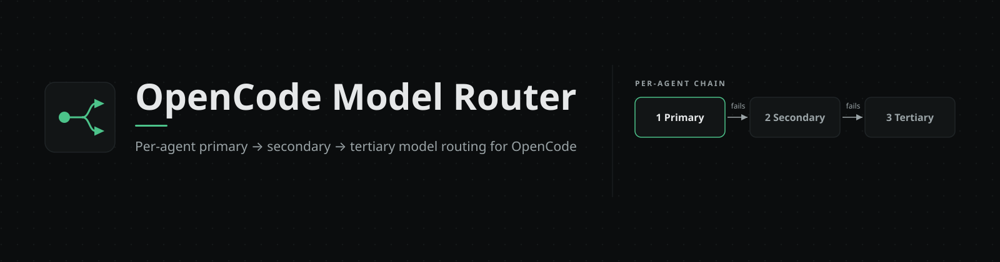
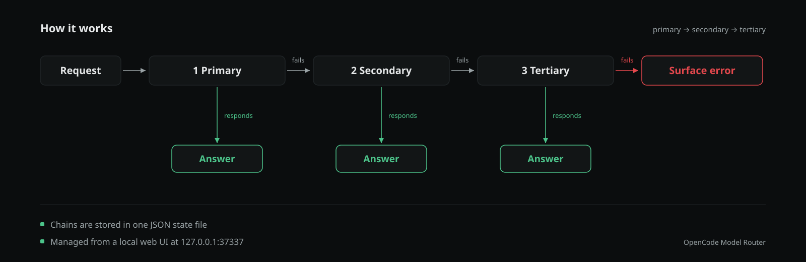

<div align="center">



[English](README.md) | **Türkçe**

[](LICENSE)


**Her OpenCode ajanına birincil, ikincil ve üçüncül model tanımlayın — yönetmek için de yerel bir web arayüzü.**

Config dosyalarını elle düzenlemeyi bırakın. Kurulumunuzda gerçekten bulunan modelleri seçin,
yanıt vermeyene karşı zincirleyin ve tek tıkla uygulayın.

</div>

---

## Neden var?

OpenCode her ajana **tek model** tanımlamanıza izin verir. O model hız sınırına takıldığında, aşırı yüklendiğinde veya çöktüğünde ajan çalışmayı bırakır — düzeltmek için de elle JSON dosyası düzenlemek gerekir ki hata yapması kolaydır.

**OpenCode Model Router** OpenCode'un üzerine eksik olan katmanı ekler:

- 🧩 **3 slotlu model zinciri** — ajan başına `birincil → ikincil → üçüncül`, otomatik yedekleme ile.
- 🖥️ **Yerel web arayüzü** — eklentinin kendisi tarafından sunulan, koyu temalı, temiz bir kontrol paneli. npm kurulumu yok, build adımı yok, bulut yok.
- ✅ **Yalnızca gerçek modeller** — seçici, OpenCode **Ayarlar → Modeller** ekranında etkinleştirdiğiniz modelleri listeler. Hayalet kayıt yok, tahmin yok.
- 🔁 **Sağlayıcı-farkındalıklı referanslar** — aynı modeli iki farklı sağlayıcı sunuyorsa bunlar iki ayrı zincir basamağı sayılır (`deepseek/deepseek-flash` ≠ `opencode-go/deepseek-v4.1-flash`).
- 🛡️ **Güvenli uygulama** — her yazımdan önce `.model-router.bak` yedeği alınır, sonra `oh-my-opencode-slim` ya da düz OpenCode için doğru dosya güncellenir.
- 📦 **Sıfır bağımlılık** — tek eklenti dosyası; tamamı Bun/Node yerleşikleriyle (`Bun.serve`, `bun:sqlite`, `node:fs`).

## Nasıl çalışır?



Her ajanın bir zinciri olur. Birincil model yanıt veremezse zincirdeki sıradaki basamak devralır — böylece tek bir hız sınırı tüm oturumunuzu kilitlemez.

Zincirler **tek bir JSON state dosyasında** yaşar. Web arayüzü bu dosyayı okur ve yazar; eklenti de gerçek OpenCode yapılandırmanıza uygular.

## Özellikler

| | |
|---|---|
| **Ajan kapsamı** | OpenCode'un tanıdığı tüm ajanlar: `orchestrator`, `explorer`, `librarian`, `oracle`, `designer`, `fixer`, `observer`, `build`, `plan` ve tanımladığınız özel ajanlar. |
| **Önce oh-my-opencode-slim** | oh-my eklentisi algılanırsa zincirler yerel `agents.<ajan>.model` dizileri olarak yazılır — yedeklemeyi oh-my'nin kendi motoru üstlenir. Aksi halde zincirler ana `opencode.jsonc` dosyasına yazılır. |
| **Variant koruması** | Reasoning variant'lı modeller (`max`, `xhigh` gibi) kaydet/uygula döngülerinde variant'ını korur. |
| **Görünürlük-farkındalıklı seçici** | Model listesi, masaüstü uygulamanızın *görünür/etkin* model kümesini yansıtır — doğrudan ayarlar deposundan okunur. |
| **Terminal alternatifi** | Klavyeden ayrılmayanlar için: `/model-router` komutu aynı seçim akışını etkileşimli sorularla yürütür. |
| **Varsayılan olarak güvenli** | Uygula hiçbir zaman yeni config anahtarı icat etmez, preset bloklarına dokunmaz ve düzenlediği her dosyanın yanına yedek bırakır. |

## Hızlı başlangıç

### Gereksinimler

- **OpenCode** masaüstü uygulaması (v2.x) — [opencode.ai](https://opencode.ai)
- **Windows** (kurulum betiği Windows yollarına göre; macOS/Linux'ta dosyaları elle kopyalayın — bkz. [Yapılandırma](#yapılandırma))
- İsteğe bağlı ama önerilir: **oh-my-opencode-slim** eklentisi

### Kurulum

```powershell
git clone https://github.com/sertdisk/OpenCode-Model-Router
cd OpenCode-Model-Router
powershell -ExecutionPolicy Bypass -File tools\install-dev.ps1
```

Betik iki şeyi kopyalar:

| Nereden (repo) | Nereye (OpenCode) |
|---|---|
| `src\model-router.js` | `~\.config\opencode\plugins\model-router.js` |
| `web\` | `~\.config\opencode\model-router-web\` |

Eklentinin yüklenmesi için **OpenCode'u yeniden başlatın**.

### İlk kullanım

1. Tarayıcıda **[http://127.0.0.1:37337](http://127.0.0.1:37337)** adresini açın. Sunucu OpenCode ile birlikte otomatik başlar — ayrı süreç yok.
2. Sol panelden bir ajan seçin.
3. Bir slota tıklayın (`1. Öncelik`, `2. Yedek`, `3. Son yedek`) ve açılan çekmeceden model seçin.
4. **Kaydet**'e basın — zincirler state dosyasına yazılır.
5. **Uygula**'ya basın — eklenti zincirleri gerçek yapılandırmanıza yazar (yedeklerle birlikte) ve ajanları yeniden yükler.

> 💡 Birincil slotu boş olan ajanlara dokunulmaz — yönlendirici yalnızca sizin yapılandırdığınız ajanları değiştirir.

## Web arayüzü

Arayüz yerel olarak `127.0.0.1:37337` adresinde sunulur — makinenizden asla dışarı çıkmaz.

- **Ajan listesi** — her ajan, geçerli etkin modeli ve 1-2-3 zincir rozetleri.
- **Zincir düzenleyici** — üç slot, görünür "yanıt vermezse → sıradaki" akışı, slot bazlı temizleme ve kaydedilmemiş değişiklik takibi.
- **Model çekmecesi** — sağlayıcı, model kimliği ve görünen ad üzerinden arama; sağlayıcıya göre gruplu; klavyeyle gezilebilir (`↑ ↓`, `Enter`, `Esc`).
- **Kaydet / Uygula** — Kaydet seçiminizi anlık görüntüler; Uygula yedek alıp yapılandırmanızı günceller.
- **Durum çubuğu** — katalog boyutu, görünür model sayısı, oh-my algılandı mı ve state dosya yolu.

Sunucuya ulaşılamazsa arayüz eski/yanlış veri göstermek yerine bunu açıkça söyler.

## Kavramlar

### Sağlayıcı-nitelikli model referansları

Model referansı bir üçlüdür: **`{ providerID, id, variant? }`**. Bu önemlidir çünkü aynı alt modeli farklı sağlayıcılar farklı kota, hız ve maliyetle sunabilir:

```
1. Birincil   deepseek/deepseek-flash              (kendi DeepSeek hesabınız)
2. İkincil    opencode-go/deepseek-v4.1-flash      (aynı model, farklı sağlayıcı)
3. Üçüncül    commandcode/xiaomi/mimo-v2.6-flash   (gerçekten farklı bir model)
```

Zincir basamakları tam üçlüye göre ayrıştırılır — `deepseek/deepseek-flash` ile `opencode-go/deepseek-v4.1-flash` ikisi de "DeepSeek Flash" olsa da ayrı basamaklardır.

### Zincirler nereye uygulanır?

| Algılanan kurulum | Nereye yazılır | Yedeklemeyi kim yapar |
|---|---|---|
| **oh-my-opencode-slim** var | `oh-my-opencode-slim.json` → `agents.<ajan>.model` (dizi) | oh-my'nin yerel zincir-yedekleme motoru |
| Düz OpenCode | `opencode.jsonc` → mevcut `agent.<ajan>.model` kayıtları | Yalnızca birincil model (host config) |

Host config güncellemeleri yalnızca `opencode.jsonc` içinde **zaten var olan** ajanlara dokunur — yönlendirici arkanızdan yeni anahtar eklemez.

## Yapılandırma

### State dosyası

`~\.config\opencode\model-router.json` — zincirlerinizin tek doğruluk kaynağı:

```json
{
  "version": 1,
  "updatedAt": "2026-10-05T19:54:16.363Z",
  "chains": {
    "orchestrator": {
      "primary":   { "providerID": "deepseek", "id": "deepseek-flash", "variant": "max" },
      "secondary": { "providerID": "commandcode", "id": "deepseek/deepseek-v4.1-flash" },
      "tertiary":  { "providerID": "opencode", "id": "mimo-v2.6-flash-free" }
    }
  }
}
```

### Ortam değişkenleri

Geliştirme ve özel kurulumlar için:

| Değişken | Varsayılan |
|---|---|
| `MODEL_ROUTER_PORT` | `37337` |
| `MODEL_ROUTER_STATE_PATH` | `~\.config\opencode\model-router.json` |
| `MODEL_ROUTER_OHMY_PATH` | `~\.config\opencode\oh-my-opencode-slim.json` |
| `MODEL_ROUTER_HOST_CONFIG` | `~\.config\opencode\opencode.jsonc` |
| `MODEL_ROUTER_WEB_DIR` | `~\.config\opencode\model-router-web` |

### Elle kurulum (macOS / Linux)

```sh
cp src/model-router.js ~/.config/opencode/plugins/model-router.js
mkdir -p ~/.config/opencode/model-router-web
cp web/* ~/.config/opencode/model-router-web/
```

## `/model-router` komutu

Terminalden ayrılmak istemiyor musunuz? Eklenti OpenCode içine bir `/model-router` komutu da kaydeder. OpenCode'un yerel soru arayüzüyle 4 soru sorar (ajan → birincil → ikincil → üçüncül) ve aynı state dosyasını yazar — tarayıcı gerekmez.

## HTTP API

Yerel sunucu küçük bir JSON API sunar (script'ler için kullanışlı):

| Uç nokta | Açıklama |
|---|---|
| `GET /api/state` | Ajanlar, zincirler, görünür modeller, katalog sayaçları, algılanan kurulum |
| `GET /api/models` | Yalnızca görünür modeller (`?all=1` ile tüm katalog) |
| `POST /api/save` | Zincirleri state dosyasına birleştirir — gövde: `{ "chains": { "<ajan>": { "primary": "provider/id", "secondary": null, "tertiary": null } } }` |
| `POST /api/apply` | Kayıtlı zincirleri gerçek config'lere uygular (`.model-router.bak` yedekleriyle) |
| `GET /api/probe` | Çalışma zamanı teşhis bilgileri |

## Geliştirme

```sh
bun tools/dev-server.mjs
```

Eklentiyi mock bağlamla (12 ajan, örnek modeller) bağımsız çalıştırır, `state → save → apply` tam self-testini **yalnızca geçici dosyalar üzerinde** koşar — gerçek yapılandırmanıza asla dokunulmaz — sonra elle test için sunucuyu açık tutar.

Sözdizimi kontrolü:

```sh
node --check src/model-router.js
node --check tools/dev-server.mjs
```

## Sorun giderme

| Belirti | Çözüm |
|---|---|
| Web arayüzüne ulaşılamıyor | OpenCode çalışıyor mu? Sunucu eklentiyle başlar. `~\.config\opencode\model-router-server.log` dosyasına bakın. |
| Log'da `EADDRINUSE` | 37337 portunu başka bir örnek tutuyor — çift örneği kapatın veya `MODEL_ROUTER_PORT` ayarlayın. |
| Seçicide model görünmüyor | En az bir sağlayıcının bağlı ve modellerin OpenCode ayarlarında etkin olduğundan emin olun. |
| Uygula "atlandı" diyor | Bazı ajanlar (`build`, `plan` gibi) oh-my ajanı değildir — yönlendirici onlara bilinçli olarak dokunmaz. |
| Değişiklikler etkili olmuyor | OpenCode'u yeniden başlatın. oh-my config'ini açılışta okur; host config değişiklikleri reload/restart sonrası etkili olur. |

## Durum ve yol haritası

- [x] Ajan zinciri düzenleyicili, sağlayıcı-gruplu model seçicili, kaydet/uygula akışlı web arayüzü
- [x] Görünürlük-farkındalıklı model kataloğu (Ayarlar → Modeller'i yansıtır)
- [x] Variant-korumalı yazımlarla oh-my-opencode-slim entegrasyonu
- [x] Her uygulamada yedekleme
- [ ] Oturum içi retry steering (yeniden başlatmadan, hata anında zincirin sıradaki basamağına geçiş)
- [ ] Platformlar arası kurulum betiği
- [ ] npm paketi yayını

## Katkı

Issue ve pull request'ler memnuniyetle karşılanır — özellikle bende olmayan kurulumlarda test edenler için (Linux, oh-my'siz düz OpenCode, özel ajanlar).

Bu eklenti oturum ortasında ölü bir ajandan kurtardıysa, **repoya yıldız verin** ⭐ — daha fazla kişinin bulmasına yardımcı olur ve geliştirmeye devam etmem için bana işaret olur. Fork'layın ve kendi iş akışınıza uyarlayın; eklentinin tamamı tek okunabilir dosyadır.

## Lisans

[MIT](LICENSE) — kullanın, fork'layın, yayınlayın.
